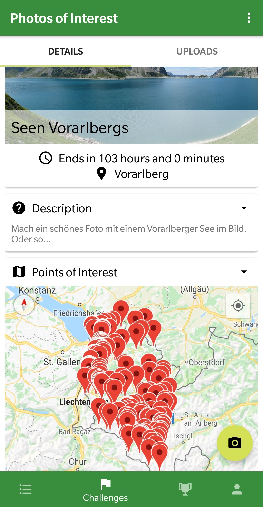
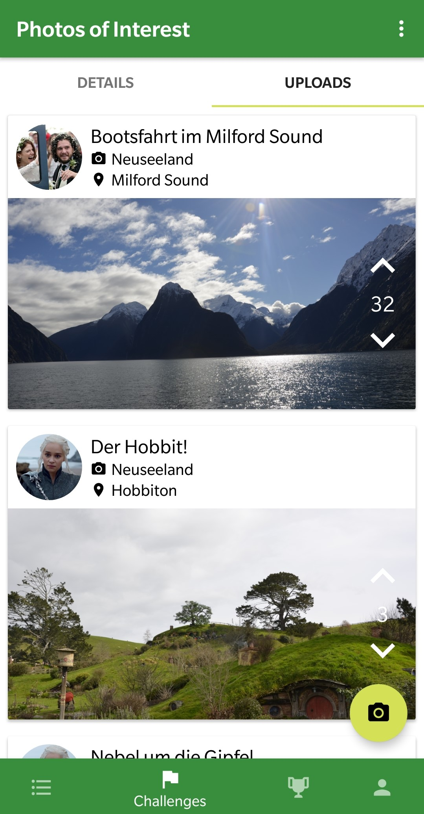
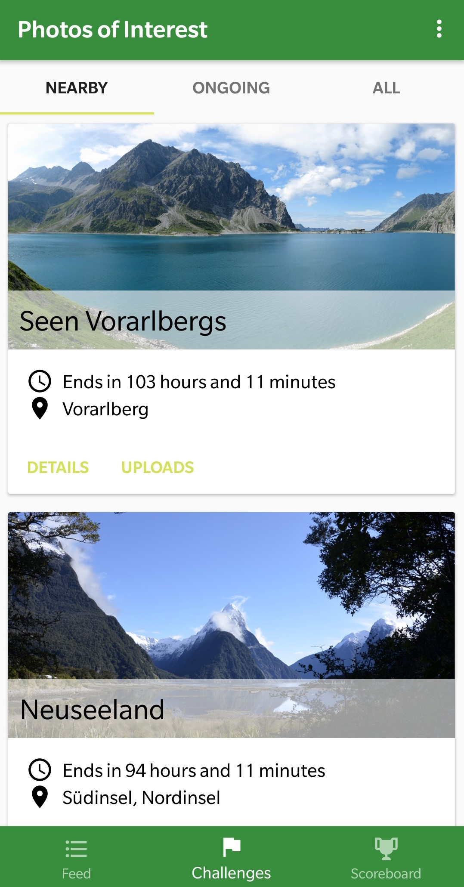

# Photos of interest

The aim of this project is to create a game combining a social component and photography.
Certain points of interest will be selected in a specified area. During the next few days or weeks
the users may travel to these POIs and snap a photo which will then be uploaded using the app.
Once uploaded, the photos may be rated by the other users. All users will be ranked in a scoreboard
to compare the results.

## tech

This project was created using Kotlin and a MVP architecture for android. The backend was created with
Firebase to provide authentication, storage and database infrastructure. Cloud functions were
used for backend functionality.

## screenshots

